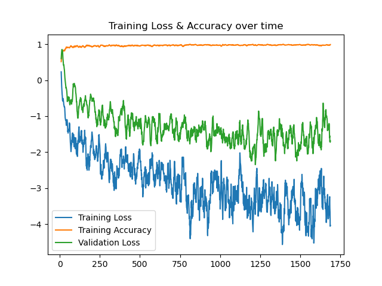

# Introduction

I trained the models on digit MNIST because I wanted convinience. Later, I might use CIFAR-10 or something like that.

# LeNet
Training and validation of LeNet.

# AlexNet

Training and validation of AlexNet.

# VGG

Training and validation of VGG.

# Network in Network (NiN)

Training and validation of NiN. Used log10 for this plot.

# ResNet18

Training and validation of ResNet18. I used log10 for this plot.

