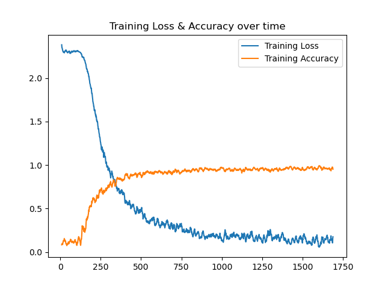
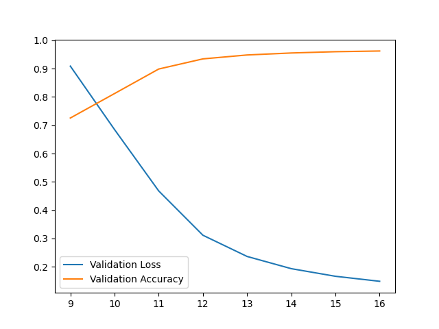
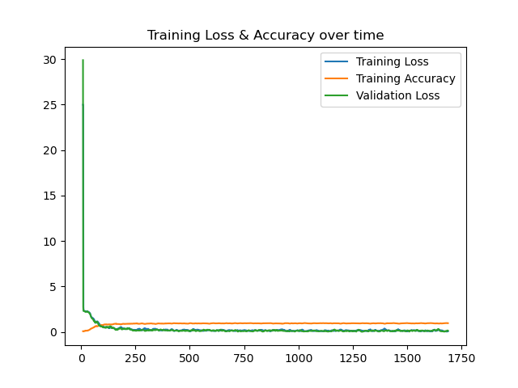
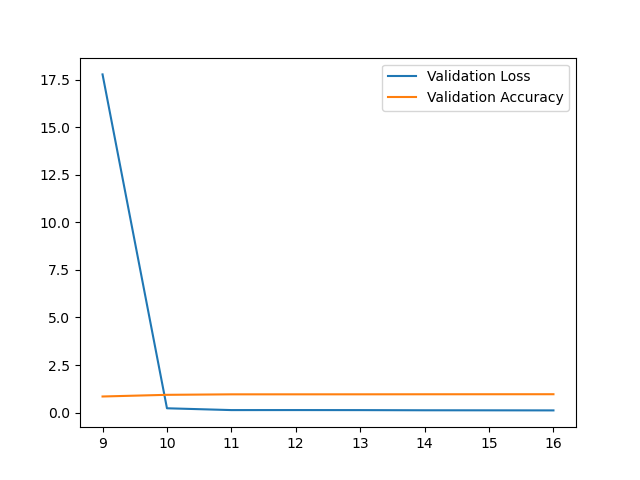
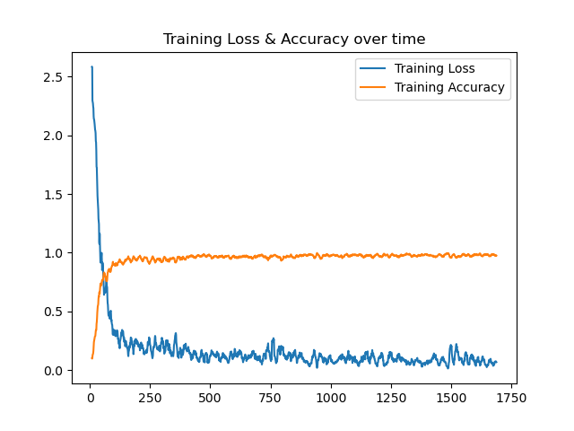
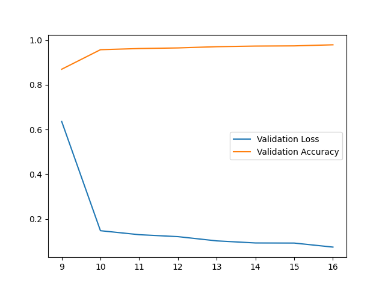
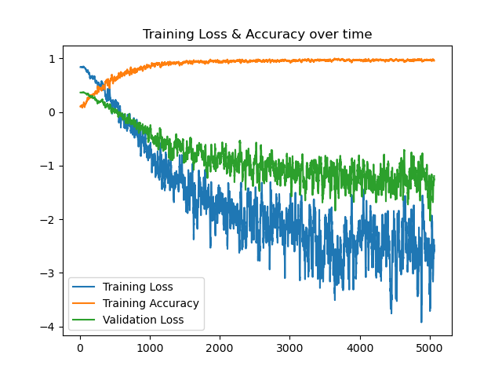

# LeNet
Training and validation of LeNet.

# AlexNet

Training and validation of AlexNet.

# VGG

Training and validation of VGG.

# Network in Network (NiN)

Training and validation of NiN.

