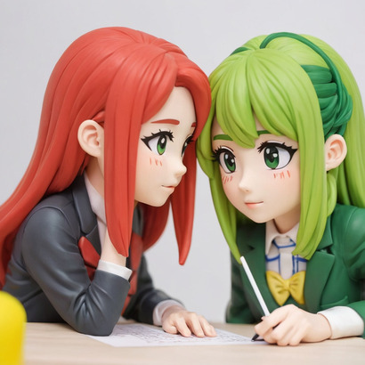

# The book of d2l in tinygrad.



This are basically my notes on d2l. I wanted to use tinygrad to challenge
myself and learn it. There is basically no information from tinygrad online
because it is not a super popular framework. That is why I decided to use it.

# Currently Implemented

- CNNs:
    -[x] LeNet
    -[x] AlexNet
    -[x] VGG
    -[x] NiN
    -[] GoogleLeNet
    -[] ResNet
    -[] DenseNet

I am using a conda environment and to activate it use:

```bash
conda activate d2l_tinygrad
```
I am using some dependencies, the following are what you should install: `matplotlib`, `tqdm`, `numpy` and of course `tinygrad`
